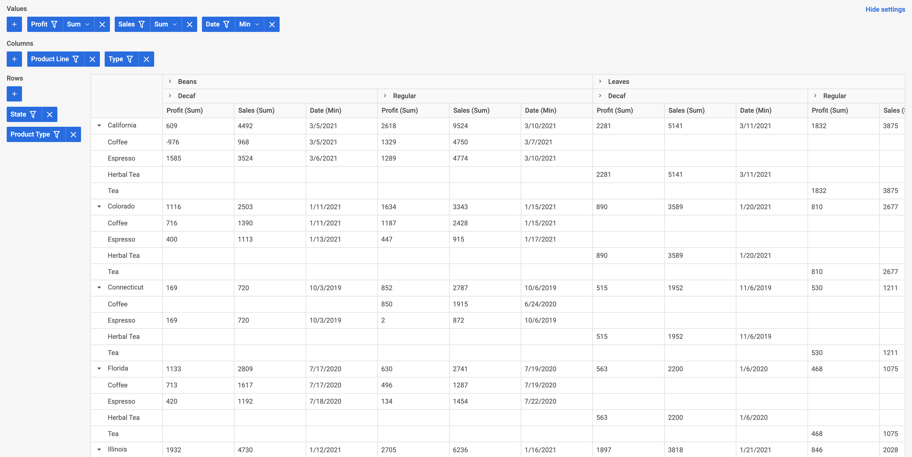

# DHTMLX Pivot with Svelte Demo

[](https://dhtmlx.com/)

[How to start](#how-to-start) | [Key features](#key-features) | [License](#license) | [Useful links](#links) | [Other examples](#examples) | [Join our online community](#join)



The DHTMLX [JavaScript Pivot table](https://dhtmlx.com/docs/products/dhtmlxPivot/) allows generating interactive data tables to help end-users summarize and analyze large datasets by organizing and presenting the data in a flexible format.

<a name="how-to-start"></a>
## How to start

### Online

[](https://codespaces.new/DHTMLX/svelte-pivot-demo)

**Please note**, having clicked on this button, you open the **online demo. Don't worry about paying extra!** With GitHub's free plan, [you get 15 GB of storage and 120 hours of Codespaces use each month](https://docs.github.com/en/billing/managing-billing-for-github-codespaces/about-billing-for-github-codespaces#monthly-included-storage-and-core-hours-for-personal-accounts). This is more than enough to run our demo without any extra costs.

### On the local host

```
yarn 
yarn start
```

or

```
npm install
npm run start
```

<a name="key-features"></a>
## DHTMLX Pivot key features

- Fast loading of large datasets
- Data filtering and sorting
- Collapsible columns and rows
- Fixed columns and rows
- Predefined math methods for data aggregation

[](https://snippet.dhtmlx.com/e6qwqrys?tag=pivot&mode=wide)
  
- Grand total for columns and rows
- Setting limits on loaded data
- Vertical orientation of text in grid headers
- Adjustable height and width
- Customizable marks for cells and built-theme

[](https://snippet.dhtmlx.com/p8imq6hx?tag=pivot)
  
- Read-only mode
- Export to Excel and CSV 
- Interface localization
- Cross-browser and cross-platform support

<a name="license"></a>
## License ##
This demo is available under the Evaluation license. To use it in your projects, please choose a proper license on the DHTMLX website: [https://dhtmlx.com/docs/products/licenses.shtml](https://dhtmlx.com/docs/products/licenses.shtml)

<a name="links"></a>
## Useful links

- [More demos about the DHTMLX Pivot functionality](https://snippet.dhtmlx.com/w2n1y9qx?tag=pivot)
- [Technical support ](https://forum.dhtmlx.com/c/pivot)
- [Online  documentation](https://docs.dhtmlx.com/pivot/)

<a name="examples"></a>
## Other examples

Check out examples of using DHTMLX Pivot with other technologies:

| JavaScript | Angular | React | Vue |
| ----- | ----- | ----- | ----- |
| [](https://dhtmlx.com/docs/products/dhtmlxPivot/) | [](https://github.com/DHTMLX/angular-pivot-demo) | [](https://github.com/DHTMLX/react-pivot-demo) | [](https://github.com/DHTMLX/vue-pivot-demo) |

<a name="join"></a>
## Join our online community

- Star our GitHub repo :star:
- Watch our tutorials on [YouTube](https://www.youtube.com/user/dhtmlx/videos) :tv:
- Read us on [Medium](https://dhtmlx.medium.com) :newspaper:
- Follow us on [X](https://x.com/dhtmlx) :bird:
- Check our news and updates on [Facebook](https://www.facebook.com/dhtmlx/) :feet:
